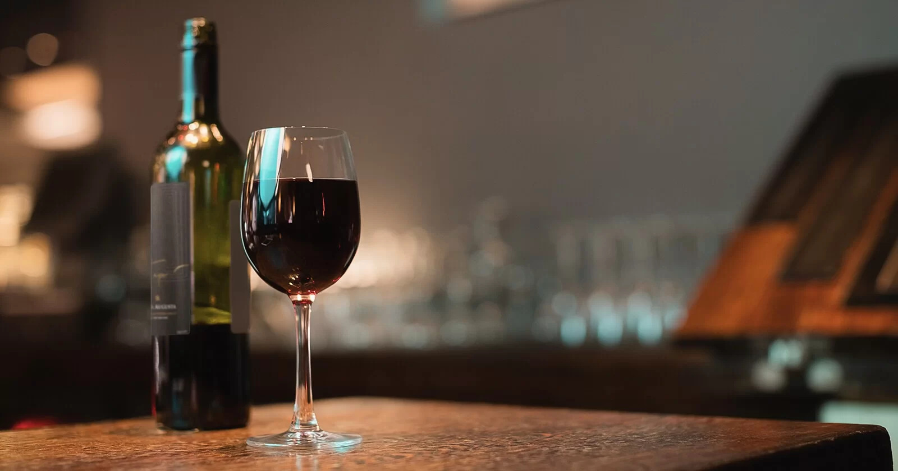

<!DOCTYPE html>
<html lang="en">
<head>
    <meta charset="UTF-8">
    <meta name="viewport" content="width=device-width, initial-scale=1.0">
    <title>Larry's</title>
    <link rel="stylesheet" type="text/css" href="css/bootstrap.min.css">
    <link rel="stylesheet" type="text/javascript" src="js/bootstrap.min.js">

    
    
    
</head>
<body class="back">
    <section class="container" >
    </section>
    <section>
        

             
        

    </section>
    <section>
        

            

                

                    Vinhos
                

                

                    Presentes
                

                

                    Fale Conosco
                

                

                    Sobre Nós
                

                

                    Trabalhe Conosco
                

            

        

    </section>
    <section>
        

            

                
            

        

    </section>

</body>
</html>
